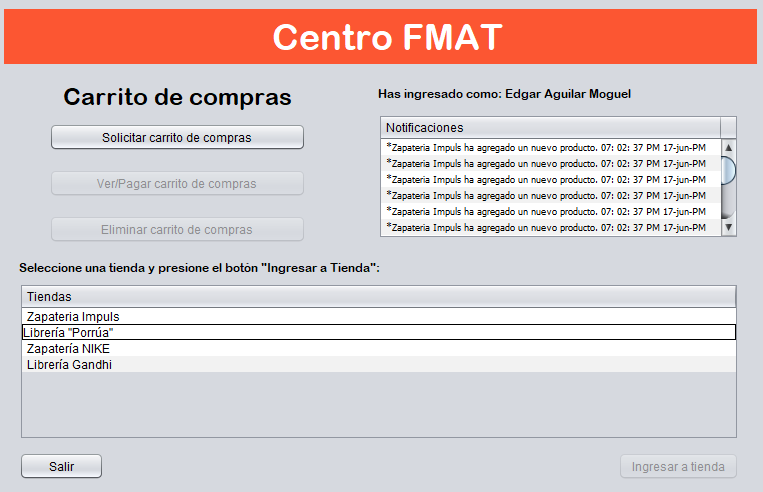
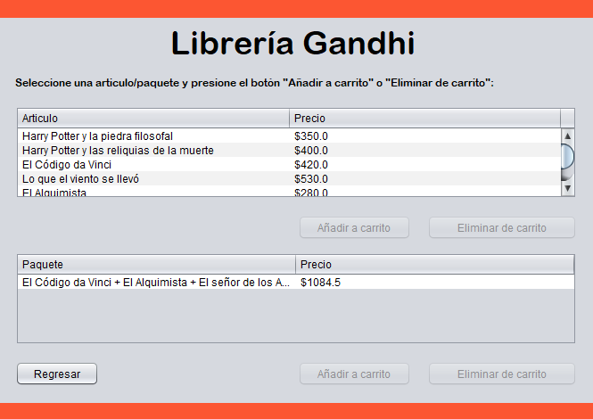
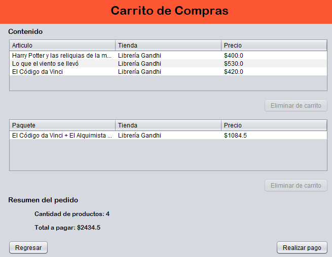

# CentroComercial

Simulation of a mall applying different desifn patterns

## Team Members

* Aguilar Moguel Edgar
* Canto Vázquez Rafael
* Cruz de la Fuente Pedro

## Project Views

### CentroComercial View

### Tienda View

### CarritoCompra View

## Project Setup

Make sure to install the latest version of java into your computer and you are ready to go

## Design Patterns

The design patterns implemented into the project are: 

* Abstract Factory
* Iterator
* States
* Decorator
* Observer
* Singleton

## Recomendations

Use netbeans IDE to work in the project